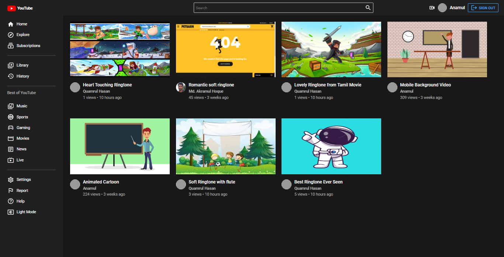
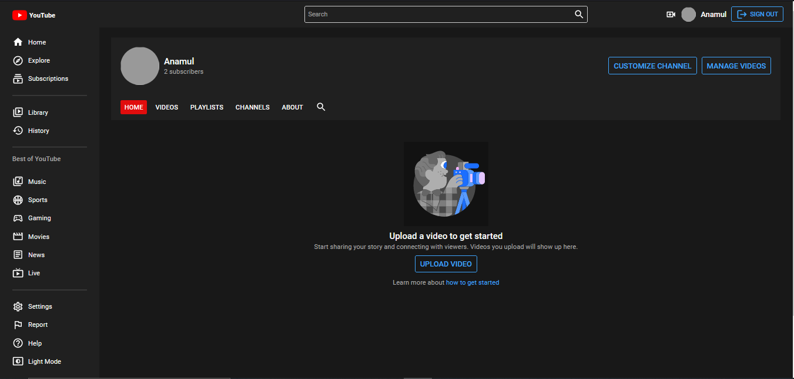
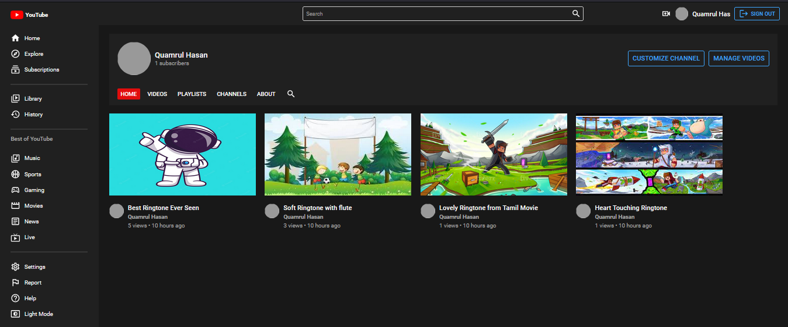
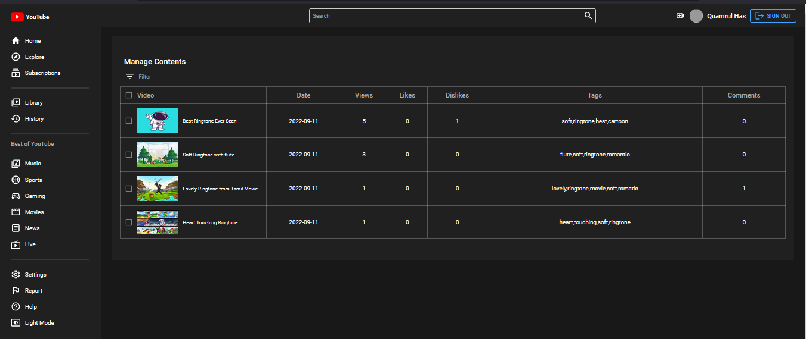

<h2>Youtube</h2>

Live Site: https://fir-21b25.firebaseapp.com/

Key Points:

- This is a MERN Stack project to match some of YouTube's functionality.
- Users can sign up and login using email, password, or Google authentication and also sign out.
- Users can upload videos, search for videos, stream videos, like, dislike, subscribe, unsubscribe, share video links on social media and also comment.
- The logged in user can also go to his dashboard and see all the information of all his uploaded videos. And if he wants to delete any of his videos, he can also delete them.
- Any user on the home page Video sorting can be done in three ways, such as random videos, trends, and subscriptions. They can also set a white or dark theme if they want.

Technologies Used:

- JavaScript
- React
- Node
- Express
- MongoDB ( Database )
- Redux
- JWT, Firebase (Google Authentication and Hosting)
- Axios
- Styled Components
- Mongoose
- Postman (API Testing)

API: https://youtube-pr.herokuapp.com/api

About API Integration and Redux with the Frontend:

- I did all CRUD operations with the above API from the frontend. I used the API besides redux, so I sent data to the backend as well as the reducer. Firstly, as I followed the MVC pattern, I configured the schema for authentication, users, and videos in the backend. Then I connected my database with the backend project and wrote all the CRUD operations functionality, and everything was tested against Postman. Then I implemented this API with my frontend. Besides every call of the API, I also implemented redux to get updates at a time in the frontend. Finally, I deployed the backend project on Heroku and the frontend project on Firebase.

Some Images:

